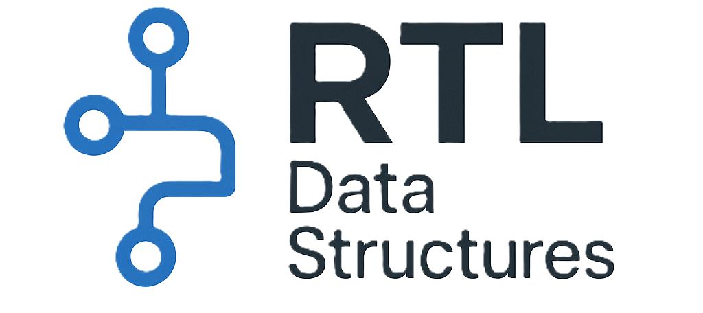

<p align="center">
  
</p>

# RTLStructLib
Highly optimized, synthesizable data structures module/IP library for hardware design

### Overview
RTLStructlib is an open-source project providing a collection of synthesizable RTL data structures implemented at the Register-Transfer Level (RTL). These modules are designed for high performance, scalability, and ease of integration into digital systems, serving as a standard library for FPGA and ASIC engineers.
By using these pre-built RTL modules, engineers can accelerate development, reduce verification time, and focus on higher-level system design.

### Features
✅ Synthesizable, Optimized, Modular and Reusable <br>
✅ Fully parameterized <br>
✅ Comprehensive verification sequence and testbench <br>
✅ Verification Agent (WIP) <br>
✅ Open-source and community-driven <br>

### Supported Data Structures
- FIFO (First-In-First-Out) Queue – Parameterized depth, support for synchronous & asynchronous modes <br>
- LIFO (Last-In-First-Out) Stack – Configurable width and depth <br>
- Singly Linked List – Efficient memory utilization, dynamic data handling <br>
- Doubly Linked List – Bi-directional traversal support <br>
- Table - Indexed storage mechanism, similar to a register file, enabling rapid direct access and simultaneous read write access to data without hashing. <br>
- Circular Linked List （WIP） 
- Hash Table (WIP) – Optimized for high-speed lookups <br>
- Systolic Array (WIP) - Organizes processing elements in a regular grid where data flows rhythmically, enabling parallel computation. <br>
- Binary Tree (WIP) – Fundamental structure for hierarchical data organization <br>
- AVL Tree (WIP) – Self-balancing binary search tree for efficient operations <br>
- List (WIP) - Support sorting, find_index, delete, insert operations <br>
- And More and More and More (WIP)

### License
This project is licensed under the MIT License – see the LICENSE file for details.

### Getting Started
1️⃣ Install required tools and package 
``` bash  
sudo apt install make git iverilog yosys gtkwave
pip install cocotb
pip install cocotb-bus
```

1️⃣ Clone the Repository <br> 
``` bash  
git clone https://github.com/Weiyet/RTL_Data_Structure.git  
```

2️⃣ Directory Structure of Each Data Structure Module <br> 
📦 \<data structure>/    # Data Structure Module as folder name <br>
 ├── 📃 readme.md        # Documentation of waveform, modules IOs, parameter. <br>
 ├── 📂 src/             # RTL Source Code <br>
 ├── 📂 tb/              # Testbench Directory <br>
 │    ├── 📂 cocotb/     # Python Cocotb Testbench <br>
 │    ├── 📂 sv/         # SystemVerilog Testbench <br>
 │    ├── 📃 rtl_list.f  # RTL file list required for the modules <br>       

2️⃣ RTL Simulation and Verification
``` bash  
# System Verilog Simulation
cd <Data Structure>/tb/sv
make sim
# Python CocoTB Simulation
cd <Data Structure>/tb/cocotb
make
```     
3️⃣ Synthesis and Netlist simulation
``` bash  
make synth
```
4️⃣ To view VCD waveform 
``` bash  
gtkwave <waveform.vcd>
```
5️⃣ Integrate to your project
Include file list <Data structure>/src/rtl_list.f to your simulation or project.

### Work in Progress/Future Works 🚀
🔹 Implementing Hash Table, Binary Tree, AVL Tree and more and more <br>
🔹 Providing comprehensive test benches (TB) for verification <br>
🔹 Exploring pyUVM for developing UVM & pyUVM agents <br>
🔹 Improving performance & adding more use cases 


