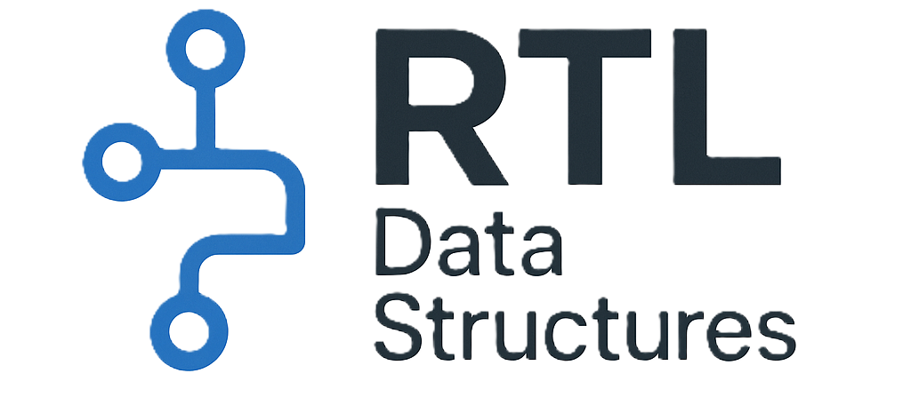

----------


<p align="center">
  
</p>

<div align="center">
  


  
</div>

# RTLStructLib
Highly optimized (trying my best), synthesizable data structures module/IP library for hardware design

### Overview
RTLStructlib is an open-source project providing a collection of synthesizable RTL data structures implemented at the Register-Transfer Level (RTL). These modules are designed for high performance, scalability, and ease of integration into digital systems, serving as a standard library for FPGA and ASIC engineers.
By using these pre-built RTL modules, engineers can accelerate development, reduce verification time, and focus on higher-level system design.

### Features
✅ Synthesizable, Optimized, Modular and Reusable <br>
✅ Fully parameterized <br>
✅ Comprehensive verification sequence and testbench <br>
✅ Verification IP (VIP) <br>
✅ Open-source and community-driven <br>

### Supported Data Structures
- FIFO (First-In-First-Out) Queue – Parameterized depth, support for synchronous & asynchronous modes <br>
- LIFO (Last-In-First-Out) Stack – Configurable width and depth <br>
- Singly Linked List – Efficient memory utilization, dynamic data handling <br>
- Doubly Linked List – Bi-directional traversal support <br>
- Table - Indexed storage mechanism, similar to a register file, enabling rapid direct access and simultaneous read write access to data without hashing. <br>
- List - Support sorting, find_index, delete, insert operations <br>
- Circular Linked List （WIP） 
- Hash Table – Optimized for high-speed lookups, currently only supports modulus hashing and simple multi-staged chaining to handle collision <br>
- Dual Edge Flip Flop - Double input and output rate structure which can latch data on both rising and falling edge <br> 
- Systolic Array (WIP) - Organizes processing elements in a regular grid where data flows rhythmically, enabling parallel computation. <br>
- Binary Tree (WIP) – Fundamental structure for hierarchical data organization <br>
- AVL Tree (WIP) – Self-balancing binary search tree for efficient operations <br>
- And More and More and More (WIP)

### License
This project is licensed under the MIT License – see the LICENSE file for details.

### Getting Started
1️⃣ Install required tools and package 
``` bash  
sudo apt install make git iverilog yosys gtkwave
pip install cocotb
pip install cocotb-bus
```

1️⃣ Clone the Repository <br> 
``` bash  
git clone https://github.com/Weiyet/RTL_Data_Structure.git  
```

2️⃣ Directory Structure of Each Data Structure Module <br> 
````
📦 <data structure>/          # Data Structure Module as folder name <br>
 ├── 📃 readme.md              # Documentation of waveform, modules IOs, parameter. <br>
 ├── 📂 src/                   # RTL Source Code <br>
 │    ├── 📃 rtl_list.f        # RTL file list required for the modules <br>    
 ├── 📂 tb/                    # Testbench Directory <br>
 │    ├── 📂 cocotb/           # Python Cocotb (Non-UVM) Testbench <br>
 │    ├── 📂 sv/               # SystemVerilog (Non-UVM) Testbench <br>   
 ├── 📂 vip/                   # Verification IP <br>
 │    ├── 📂 uvm/              # system verilog UVM <br>
 |    |    ├── 📃 readme.md    # Documentation of VIP <br>
 │    ├── 📂 pyuvm/            # python UVM <br>
 |    |    ├── 📃 readme.md    # Documentation of VIP <br>
 ````
2️⃣ RTL Simulation and Verification
``` bash  
# System Verilog Simulation
cd <Data Structure>/tb/sv
make sim
# Python CocoTB Simulation
cd <Data Structure>/tb/cocotb
make
```     
3️⃣ Synthesis and Netlist simulation
``` bash  
make synth
```
4️⃣ To view VCD waveform 
``` bash  
gtkwave <waveform.vcd>
```
5️⃣ Integrate to your project
Include file list <Data structure>/src/rtl_list.f to your simulation or project.

### Work in Progress/Future Works 🚀
🔹 Implementing Hash Binary Tree, AVL Tree and more and more <br>
🔹 Improving performance & adding more use cases <br>
🔹 Study research paper and implement more hardware oriented algorithm or data streamline for HW data structure <br>

### Disclaimer 
Hardware is often highly customized — these modules are designed as references, and you're encouraged to tweak them as needed (e.g., swap registers with RAM, adjust logic latency based on your STA, use content addressable RAM instead of RTL hash table). 1
<!--stackedit_data:
eyJoaXN0b3J5IjpbMjA2OTkxOTM3Miw4NjkzNTIyOSwtODAyNz
Y1MDgxXX0=
-->